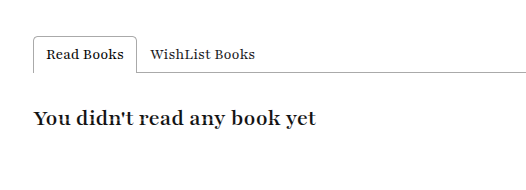
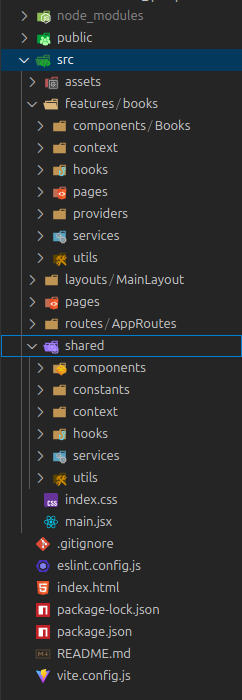

# Project Name: Book Vibe

## Project Description:  

Book Vibe is a React-based single-page application (SPA) for tracking and exploring books. Users can browse all available books, view detailed information, mark books as read, or add them to their wishlist. The app includes sorting features that allow users to organize books by pages or ratings, and visualize their reading progress through an interactive chart.

## Live Site Link:

https://web-project-22.netlify.app/

## Project Video:

## What I Learned New while Building This Project:
1. We can catch runtime error automatically with the help of react-router errorElement and useRouteError()

```jsx
import { createBrowserRouter } from "react-router";
import HomePage from "../../pages/HomePage/HomePage";
import MainLayout from "../../layouts/MainLayout/MainLayout";
import ErrorPage from "../../pages/ErrorPage/ErrorPage";
import NotFoundPage from "../../pages/NotFoundPage/NotFoundPage";

export const AppRoutes = createBrowserRouter([
    {
        path: '/',
        Component: MainLayout,
        errorElement: <ErrorPage></ErrorPage>,
        children: [
            {
                index: true,
                Component: HomePage
            }
        ]

    },
    {
        path: "*",
        element: <NotFoundPage></NotFoundPage>
    }
])
```

```jsx
import React from 'react';
import { Link, useRouteError } from 'react-router';

const ErrorPage = () => {
    const error = useRouteError();

    if (error.status === 404) {
        return <NotFoundPage />;
    }

    console.error(error);
    return (
        <div className="flex flex-col items-center justify-center min-h-screen text-center">
            <h1 className="text-3xl font-bold mb-2">Something went wrong 😢</h1>
            <p className="mb-4 text-gray-600">{error?.status || "Unknown"}</p>
            <p className="mb-4 text-gray-600">{error?.statusText || "No status text"}</p>
            <p className="mb-4 text-gray-600">{error?.message || "No message provided"}</p>
            {error?.data && (
                <p className="mb-4 text-gray-600">{JSON.stringify(error.data)}</p>
            )}
            <Link to="/" className="text-blue-600 underline">
                Go Home
            </Link>
        </div>
    );
};

export default ErrorPage;
```

2. How to use a skeleton: 

```jsx
import React, { useEffect, useState } from 'react';
import BooksCard from './BooksCard/BooksCard';
import Skeleton from '../../../../shared/components/ui/spinners/Skeleton/Skeleton';

const Books = () => {
    const [books, setBooks] = useState([])
    const [loading, setLoading] = useState(true)
    const [error, setError] = useState(null)

    useEffect(() => {
        fetch('/booksData.json')
            .then(res => res.json())
            .then(data => setBooks(data))
            .catch(err => setError(err))
            .finally(() => setLoading(false))
    }, [])


    return (
        <div className='py-[100px]'>
            <h2 className='text-[40px] font-bold text-center pb-9'>Books</h2>
            <div className='grid grid-cols-1 md:grid-cols-2 xl:grid-cols-3 gap-6'>
                {error && <p className='text-red-500 text-center col-span-full text-3xl'>{error.message}</p>}
                {loading && Array(6).fill(0).map((_, index) => <Skeleton key={index}></Skeleton>)}
                {books.map((book) => <BooksCard key={book.bookId} book={book}></BooksCard>)}
            </div>
        </div>
    );
};

export default Books;
```

```jsx
import React from 'react';
import Container from '../../../structure/Container/Container';

const Skeleton = () => {
    return (
        <Container>
            <div className="flex w-80 flex-col gap-4 pb-10">
                <div className="skeleton h-40 w-full"></div>
                <div className="skeleton h-4 w-28"></div>
                <div className="skeleton h-4 w-full"></div>
                <div className="skeleton h-4 w-full"></div>
            </div>
        </Container>
    );
};

export default Skeleton;
```
3. How to use react-tabs: 

```jsx
npm install --save react-tabs
```

```jsx
import React from 'react';
import { Tab, Tabs, TabList, TabPanel } from 'react-tabs';
import 'react-tabs/style/react-tabs.css';

const ListedBooksPage = () => {
    return (
        <div className='mb-[100px]'>
            <h1 className='work-sans font-bold text-[28px] text-primary-content text-center py-8 bg-[#13131305] rounded-2xl mb-[140px]'>Books</h1>
            <div>
                <Tabs>
                    <TabList>
                        <Tab>Title 1</Tab>
                        <Tab>Title 2</Tab>
                    </TabList>

                    <TabPanel>
                        <h2>Any content 1</h2>
                    </TabPanel>
                    <TabPanel>
                        <h2>Any content 2</h2>
                    </TabPanel>
                </Tabs>
            </div>
        </div>
    );
};

export default ListedBooksPage;
```



4. How to navigate relative path: 

```jsx
import { createBrowserRouter } from "react-router";
import HomePage from "../../pages/HomePage/HomePage";
import MainLayout from "../../layouts/MainLayout/MainLayout";
import ErrorPage from "../../pages/ErrorPage/ErrorPage";
import NotFoundPage from "../../pages/NotFoundPage/NotFoundPage";
import BookDetailsPage from "../../features/books/pages/BookDetailsPage/BookDetailsPage";
import ListedBooksPage from "../../features/books/pages/ListedBooksPage/ListedBooksPage";

export const AppRoutes = createBrowserRouter([
    {
        path: '/',
        Component: MainLayout,
        errorElement: <ErrorPage></ErrorPage>,
        children: [
            {
                index: true,
                Component: HomePage
            },
            {
                path: 'book-details/:id',
                Component: BookDetailsPage
            },
            {
                path: 'listed-books',
                Component: ListedBooksPage,
            },
        ]
    },
    {
        path: "*",
        element: <NotFoundPage></NotFoundPage>
    }
])
```

```jsx
import React from 'react';
import { Tab, Tabs, TabList, TabPanel } from 'react-tabs';
import 'react-tabs/style/react-tabs.css';
import { useReadLits } from '../../hooks/useReadList';
import { CiLocationOn } from 'react-icons/ci';
import { IoBookOutline, IoPeopleOutline } from 'react-icons/io5';
import { useNavigate } from 'react-router';

const ListedBooksPage = () => {

    const { readList, wishlist } = useReadLits()
    const navigate = useNavigate()

    const handleClick = (id) => {
        navigate(`../book-details/${id}`)
    }

    return (
        <div className='mb-[100px]'>
            <h1 className='work-sans font-bold text-[28px] text-primary-content text-center py-8 bg-[#13131305] rounded-2xl mb-[140px]'>Books</h1>
            <div>
                <Tabs>
                    <TabList>
                        <Tab>Read Books</Tab>
                        <Tab>WishList Books</Tab>
                    </TabList>

                    <TabPanel>
                        {readList.map(list => <div key={list.bookId} className='border border-[#13131315] rounded-2xl p-6 my-8 flex gap-6'>
                            <div className='bg-[#13131305] rounded-2xl py-[50px] px-7'>
                                
                            </div>
                            <div className='space-y-4'>
                                <h2 className='font-bold text-2xl text-primary-content'>{list.bookName}</h2>
                                <p className='work-sans font-medium text-secondary-content'>By: {list.author}</p>
                                <div className='flex gap-4 items-center'>
                                    <div className='flex gap-4 items-center'>
                                        <p className='work-sand font-bold'>Tag</p>
                                        {list.tags.map((tag, index) => <p key={index} className='text-primary font-medium bg-[#23BE0A05] rounded-[30px] py-2.5 px-4'>#{tag}</p>)}
                                    </div>
                                    <div className='text-secondary-content flex gap-3 items-center'>
                                        <CiLocationOn />
                                        <p>Year of Publishing: {list.yearOfPublishing}</p>
                                    </div>
                                </div>
                                <div className='work-sans text-secondary-content flex items-center gap-4'>
                                    <div className='flex gap-2 items-center'>
                                        <IoPeopleOutline />
                                        <p>Publisher: {list.publisher}</p>
                                    </div>
                                    <div className='flex gap-2 items-center'>
                                        <IoBookOutline />
                                        <p>Page: {list.totalPages}</p>
                                    </div>
                                </div>
                                <hr className='text-[#13131315]' />
                                <div className='flex items-center gap-3 work-sans'>
                                    <p className='text-[#328EFF] py-[11px] px-[20px] rounded-[30px] bg-[#328EFF15]'>Category: {list.category}</p>
                                    <p className='text-[#FFAC33] py-[11px] px-[20px] rounded-[30px] bg-[#FFAC3315]'>Rating: {list.rating}</p>
                                    <p onClick={() => handleClick(list.bookId)} className='text-white py-[11px] px-[20px] rounded-[30px] bg-primary cursor-pointer'>View Details</p>
                                </div>
                            </div>
                        </div>)}
                    </TabPanel>
                    <TabPanel>
                        <h2>Any content 2</h2>
                    </TabPanel>
                </Tabs>
            </div>
        </div>
    );
};

export default ListedBooksPage;
```
5. how to implement custom re-chart:

```jsx
import React from 'react';
import { BarChart, Bar, Cell, XAxis, YAxis, CartesianGrid, ResponsiveContainer } from 'recharts';
import { useReadLits } from '../../hooks/useReadList';

const PagesToReadPage = () => {
    const colors = ['#0088FE', '#00C49F', '#FFBB28', '#FF8042', 'red', 'pink'];


    const getPath = (x, y, width, height) => {
        return `M${x},${y + height}C${x + width / 3},${y + height} ${x + width / 2},${y + height / 3}
  ${x + width / 2}, ${y}
  C${x + width / 2},${y + height / 3} ${x + (2 * width) / 3},${y + height} ${x + width}, ${y + height}
  Z`;
    };

    const TriangleBar = (props) => {
        const { fill, x, y, width, height } = props;

        return <path d={getPath(x, y, width, height)} stroke="none" fill={fill} />;
    };


    const { readList } = useReadLits()
    const data = readList || []
    return (
        <div className='bg-gray-100 mb-20 mt-10 p-3 xl:px-10 xl:py-28 rounded-3xl '>
            <ResponsiveContainer width="100%" height={500}>
                <BarChart
                    data={data}
                >
                    <CartesianGrid stroke="#ccc" strokeDasharray="5 5" />
                    <XAxis dataKey="bookName" />
                    <YAxis />
                    <Bar dataKey="totalPages" fill="#8884d8" shape={<TriangleBar />} label={{ position: 'top' }}>
                        {data.map((entry, index) => (
                            <Cell key={`cell-${index}`} fill={colors[index % 20]} />
                        ))}
                    </Bar>
                </BarChart>
            </ResponsiveContainer>
        </div>
    );
};

export default PagesToReadPage;
```


## Challenges I faced while Building This Project:
1. I had a bit of trouble aligning the drawer icon to the right.

```jsx
{/* drawer */}
<div className="drawer justify-end drawer-end lg:hidden">
    <input id="my-drawer-4" type="checkbox" className="drawer-toggle" />
    <div className="drawer-content">
        {/* Page content here */}
        <label htmlFor="my-drawer-4" className="btn"><CiMenuFries /></label>
    </div>
    <div className="drawer-side">
        <label htmlFor="my-drawer-4" aria-label="close sidebar" className="drawer-overlay"></label>
        <ul className="menu bg-base-200 text-base-content min-h-full w-52 p-4 ">
            {/* Sidebar content here */}
            {navItems.map((item) => <li key={item.id}><Link to={item.to}>{item.value}</Link></li>)}
            <li><a href="">Sign In</a></li>
            <li><a href="">Sign Up</a></li>
        </ul>
    </div>
</div>
```

2. For the first time in this project i implement feature-based folder structure, so it's fell little bit complicated for me.



## Contact With Me: 

tamim.muhammad2005@gmail.com | +8801586090360 (WhatsApp)  

https://www.linkedin.com/in/tamim-muhammad
